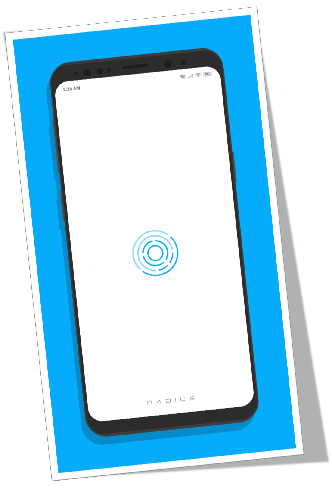
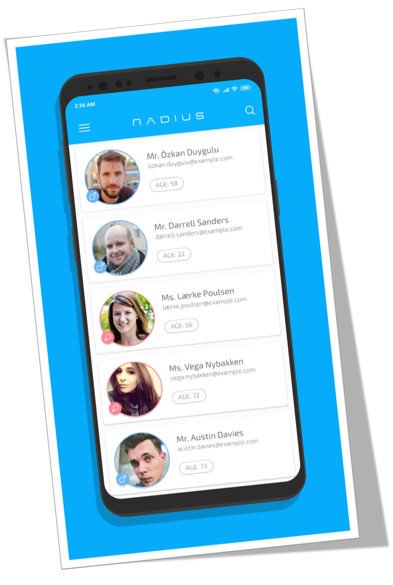

# Radius Agent

Formerly known as **Agentdesks**, **Radius** is a social network for agents, that facilitates referrals among **real estate professionals** across the country. While the network is free to join, agents who close deals with buyers through **Radius** pay 25 percent to the agent who sent the client and 5 percent to **Radius**. Agents who close deals with sellers pay 25 percent to the **referring** agent and 10 percent to **Radius**.
  
Visit Their Website Now : [Radius Agent](http://radiusagent.com).

## What is a JSON? 

**JSON** stands for **JavaScript Object Notation**, and is a way to store information in an organized, easy-to-access manner. In a nutshell, it gives us a human-readable collection of data that we can access in a really logical manner. JSON

### JSON Parsing

**JSON Parsing** is a method of extraction of **Keys** and **Values** from a JSON String to generate a Map of those **Keys** and **Values**.

### JSON Parser

**JSON Parser** is a computer program which takes **JSON String** as an input, understands the structure of the given **JSON String** and generates the output in a form of required **Data Structure**.

## About This Application

This **Mobile Appliaction** shoots an HTTP Request to the backend server located at this [link](https://raw.githubusercontent.com/iranjith4/radius-intern-mobile/master/users.json). Which returns a **JSON String**. Now this **Nested JSON String** is parsed by the application to generate an **ArrayList** Data Structure with **Java Serialised Object** as its elements. Now this ArrayList is used as an input for the Custom Adapter to populate the **Recycler View**.    
This project is thoroughly for **Educational Purpose**, as it reflects precise implementation of :
  
- Shooting HTTP Request
- Request and Wait Callback
- Nested JSON Parsing
- Scrolling Appbar
- Recycler Views
- Custom Adapters
- UI/UX Development

## Screenshots

## Download  
This **Mobile Appliaction** is ready to be tried. Get your hands on it now.  

